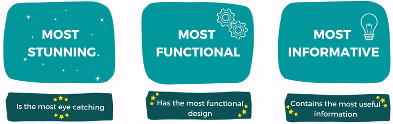

---

# Award Categories 🏆

# What to do 📜
You can submit a repo for evaluation to the email address that sent you the link to get here. 
The repo can be either one within your own domain set, or it can be a fork of this particular
repo. Steps on how to fork can be found below under the "How to Fork a Repo in GitHub".

Have a look at some of the below links to kickstart your markdown experience.

<table width="680">
    <tbody>
        <tr valign="top">
            <td align="center">
            
            </td>
            <td align="center">
            
            </td>
            <td align="center">
            
            </td>
            <td align="center">
            
            </td>
            <td align="center">
            
            </td>
        </tr>
    </tbody>
</table>

Markdown linting(for syntactically correctness) can be found here:
<table width="350">
    <tbody>
        <tr valign="top">
            <td align="center">
            
            </td>
            <td align="center">
            
            </td>
        </tr>
    </tbody>
</table>

## How to Fork a Repo in GitHub 📗
Forking a repository is the matter of clicking a button.

To follow along, browse to a public repository that you want to fork. At the top right of the page, you will find the Fork button. Click on the button and wait for a few seconds. You will see that the newly forked repository gets created under your GitHub account.

Follow the steps we learned above after forking the repository to start contributing.

# Let's Practice Forking 🔧
As a newbie, do you want to practice forking to be more confident? Let's do that. You can perform these tasks to practice forking.

- [ ] Browse to this public repository: https://github.com/echapmanFromBunnings/readme-comp
- [ ] Create a folder with the same name as your GitHub user-id (it is echapmanFromBunnings for me).
- [ ] Add a Readme.md file inside the folder with any text of your choice.
- [ ] Create a Pull Request upstream. I shall review and merge it if all is well.

Don't worry if you go wrong. Keep trying, you will get it. It will be like a practice playground of contributing to an open-source repository.
